## Training

### Train set

- BRIR

  Roomsim_Campbell

- Sound source

  TIMIT

  - Train set

    1. 8 mic positions

    2. 21 target source positions (-50~50)

	  3. 10 interfering source position($$\pm 5,\pm 10,\pm 20,\pm 30,\pm 40$$)

    4. 3 SNR (0,10,20 dB)

  sentence = 5040

  sentence_mic_pos = 630

## Test set

To obtain reliable models, GMMs are train with features selected based on 4 criterias:
1. VAD (**before frequency analysis**)

    Select frames of which energy exceed the threshold (energe maximum - 40)

2. Target is dominant

  >the signals of the left and the right ear were added **prior** to energy computaion

$$
\begin{equation}
  \begin{aligned}
  SNR = \frac{\sum\left(s^{tar}_L(t)+s^{tar}_R(t)\right)^2}{\sum\left(s^{inter}_L(t)+s^{inter}_R(t)\right)^2}
  \end{aligned}
  \end{equation}
$$

3. L,R channels are correlated

    Frame with binaural cross-correlation maximum exceed the threshold (0.3)

4. ITD estimations are within (-1,1)ms

Cues

e.g.

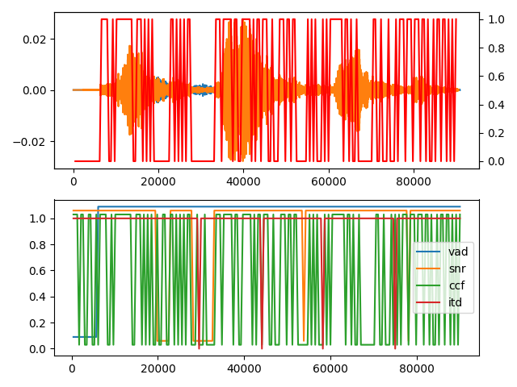

### Training

Example: sound source in the front (azimuth=0), training result of 32 frequency bands

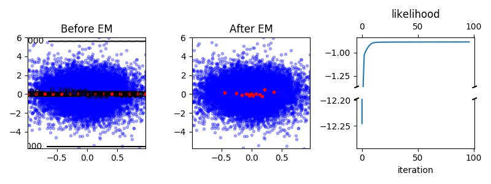

## Evaluation

Comparable result in reference paper (hightlighted)

Illustration of azimuth estimation
<table>
  <tr>
    <th>#source</th> <th>-50</th> <th>0</th> <th>50</th>
  </tr>
  <tr>
    <th>1</th>
    <td>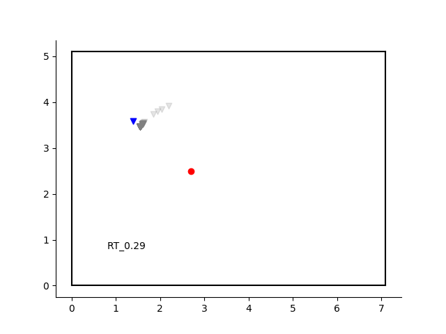</td>
    <td>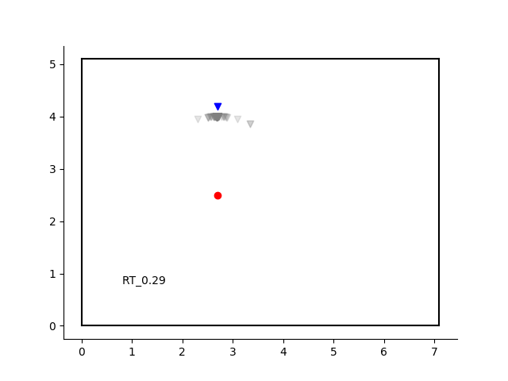</td>
    <td>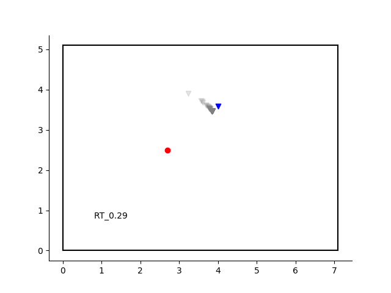</td>
  </tr>
  <tr>
    <th>2</th>
    <td>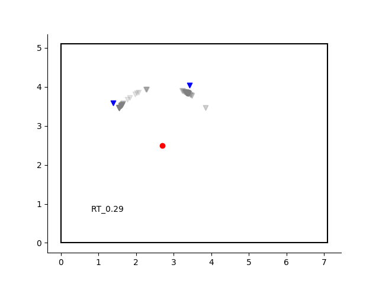</td>
    <td>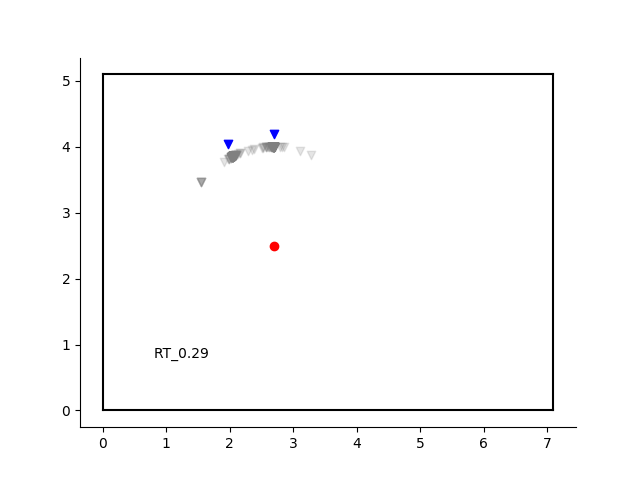</td>
    <td>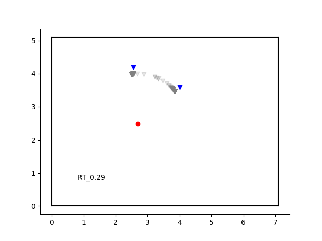</td>
  </tr>
  <tr>
    <th>3</th>
    <td>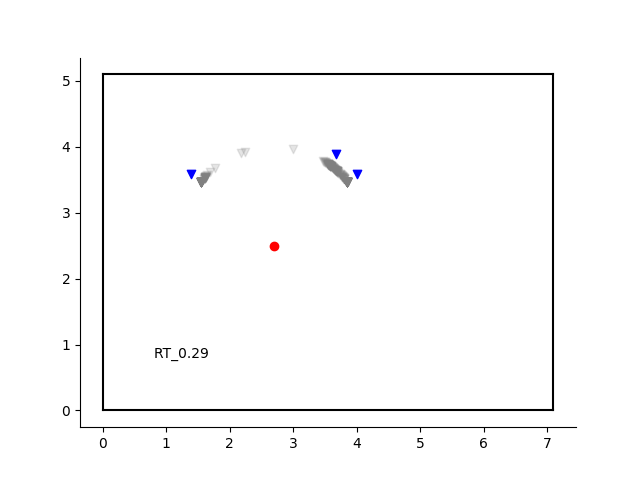</td>
    <td>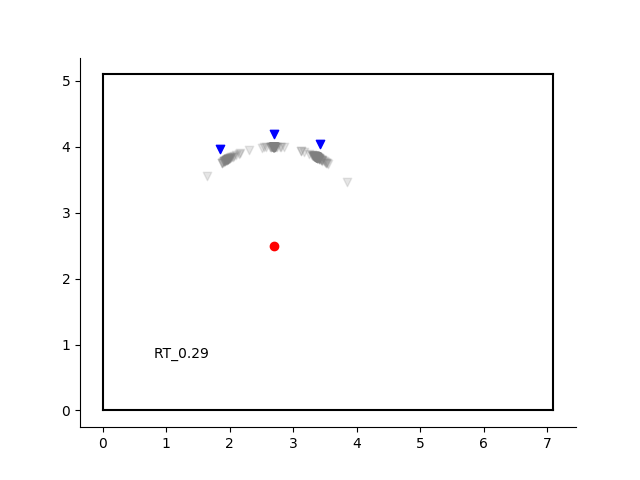</td>
    <td>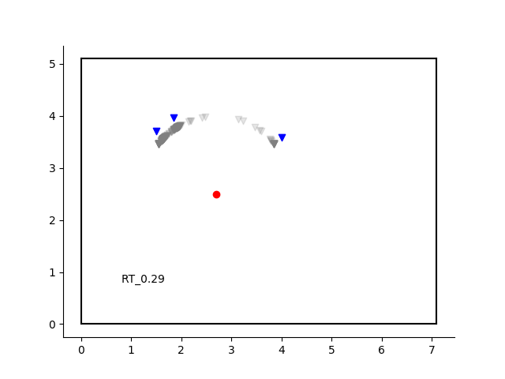</td>
  </tr>
  <tr>
    <th>4</th>
    <td>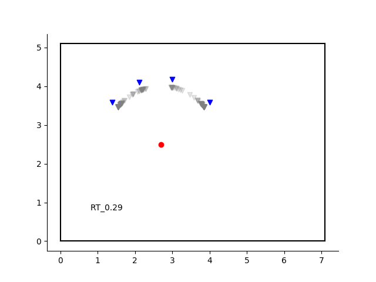</td>
    <td>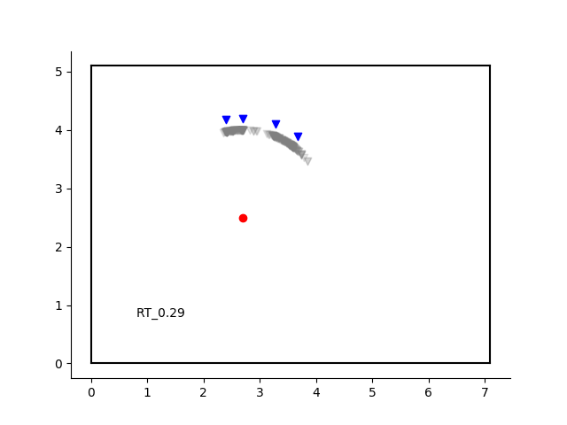</td>
    <td>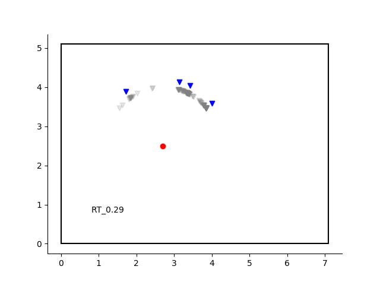</td>
  </tr>
</table>